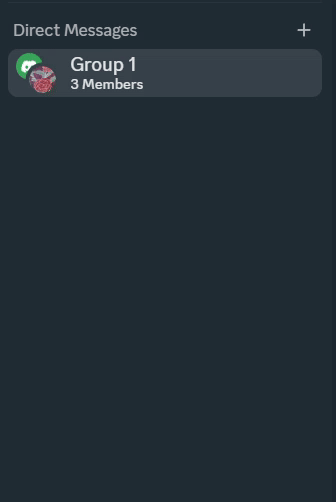

## Installation

Move the hidegroupchat.plugin.js file into your Better Discord plugins folder and enable the plugin in your Discord settings. 

## How to use
Press the group chat close button to hide the group chat. When you open a group chat it will be re added to the DM list.
